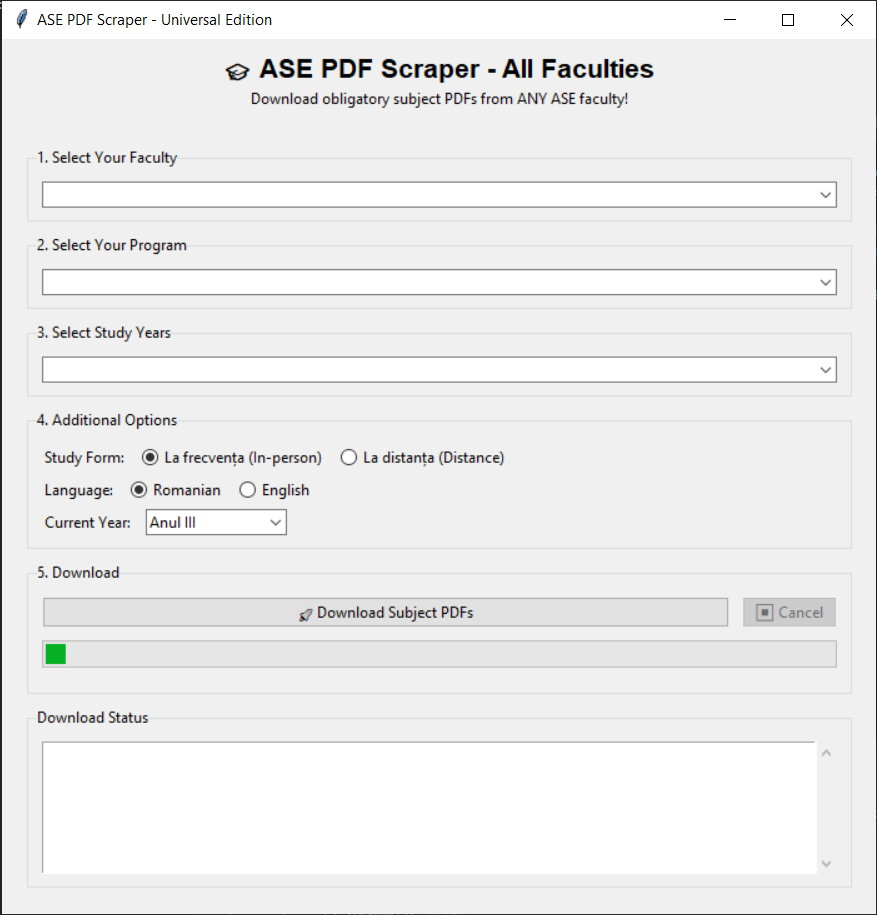

# 🎓 ASE PDF Scraper

**Automatically download all obligatory subject PDFs from ANY ASE faculty!**

A user-friendly tool that bypasses ASE's anti-automation measures and downloads all "obligatory" subject PDFs with clean, organized filenames.

## 📸 Screenshot



## ✨ Features

- 🎨 **Beautiful GUI Interface** - No code editing required
- 🌍 **Universal Support** - Works for ALL 12 ASE faculties
- 🛡️ **Anti-Automation Bypass** - Smart form navigation
- 📁 **Clean Organization** - PDFs organized by semester with no timestamps
- 🌐 **Multi-Language** - Romanian and English PDFs supported
- 💾 **Settings Memory** - Remembers your last configuration
- 📦 **Standalone .exe** - No Python installation needed!

## 🚀 Quick Start

### For Students (No Coding Required)

1. **Download** the latest `ASE_PDF_Scraper.exe` from [Releases](../../releases)
2. **Double-click** the .exe file
3. **Select** your faculty, program, and year
4. **Click** "Download Subject PDFs"
5. **Done!** Find your PDFs in the `ASE_PDFs` folder

### For Developers

```bash
# Clone the repository
git clone https://github.com/bujordragos/ase-pdf-scraper.git
cd ase-pdf-scraper

# Install dependencies
pip install -r requirements.txt

# Run the GUI
python ase_gui_downloader.py

# OR build your own .exe
python build_exe.py
```

## 📋 Supported Faculties

✅ **Cibernetică, Statistică și Informatică Economică** (CSIE)

✅ **Marketing**

✅ **Management**

✅ **Finanțe, Asigurări, Bănci și Burse de Valori** (FABV)

✅ **Contabilitate și Informatică de Gestiune** (CIG)

✅ **Relații Economice Internaționale** (REI)

✅ **Drept și Administrație Publică**

✅ **Economie Teoretică și Aplicată** (ETA)

✅ **Administrație și Management Public** (FAMP)

✅ **Comerț**

✅ **Administrarea Afacerilor cu Predare în Limbi Străine** (FABIZ)

✅ **Agribusiness și Economia Mediului**

✅ **Business și Turism** (BT)  

## 🔧 Installation

1. **Clone the repository**:
   ```bash
   git clone https://github.com/bujordragos/ase-pdf-scraper.git
   cd ase-pdf-scraper
   ```

2. **Run the GUI**:
   ```bash
   python ase_gui_downloader.py
   ```

## 📁 Output Structure

Downloads are cleanly organized by semester:
```
ASE_PDFs/
├── Informatica_economica_Anul_III_2023-2026/
│   ├── Semestrul_I/
│   │   ├── Econometrie.pdf
│   │   ├── Statistica.pdf
│   │   └── ...
│   └── Semestrul_II/
│       ├── Retele_de_calculatoare.pdf
│       └── ...
├── _archive/              # Old downloads for comparison
├── _logs/                 # Debug logs
└── _debug/                # Troubleshooting files
```

## 🎯 Why This Tool?

- **Saves Hours**: No more manual clicking through ASE's complex forms
- **Auto-Archive**: Keeps old versions for comparison
- **Clean Filenames**: No diacritics, organized by semester
- **Reliable**: Handles ASE's anti-automation measures
- **Universal**: Works for any ASE student, any faculty

## 🔧 Building the .exe

```bash
# Build standalone executable (no Python needed to run it)
python build_exe.py

# Output: dist/ASE_PDF_Scraper.exe (~15MB)
```

The .exe includes everything - no Python, no pip install, just double-click and go!

## 🛠️ Development

### Project Structure
```
ase-pdf-scraper/
├── ase_gui_downloader.py          # Main GUI application
├── ase_universal_downloader.py    # Scraping logic
├── build_exe.py                   # .exe builder
├── requirements.txt               # Dependencies
├── run_gui.bat                    # Quick launcher (Windows)
└── README_EXE.txt                 # User instructions for .exe
```

### Maintenance Notes

Faculty configs need updating ~once per year when new cohorts start. Update `FACULTY_CONFIGS` in `ase_gui_downloader.py`:
- Add new year ranges (e.g., `2026-2029`)
- Verify program names occasionally
- Scraping uses keywords, so minor name differences still work

## 📜 License

MIT License - Use responsibly and respect ASE's servers.

---

**Created by ASE Student for ASE Students**
